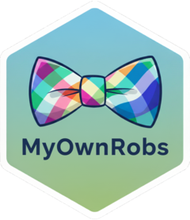

# MyOwnRobs <a href="https://myownrobs.github.io/myownrobs/"></a>

*By R users for R users*

<!-- badges: start -->

[](https://github.com/MyOwnRobs/myownrobs/actions/workflows/R-CMD-check.yaml)
[](https://cran.r-project.org/package=myownrobs)
[](https://app.codecov.io/gh/MyOwnRobs/myownrobs)
<!-- badges: end -->

**A Cursor-style AI Coding Agent for RStudio**

MyOwnRobs is a comprehensive AI-powered coding agent that seamlessly
integrates as an RStudio extension, bringing state-of-the-art AI
capabilities directly to R developers through an autonomous agent-based
approach.

## 🚀 Features

- **🤖 Autonomous AI Agent**: True coding agent that automatically
  selects and executes appropriate tools based on natural language
  requests
- **💬 Integrated Chat Interface**: Familiar Shiny-based chat experience
  directly in RStudio
- **🔧 Comprehensive Toolkit**: Complete set of development tools
  including file operations, code execution, and project management
- **🎯 Context Awareness**: Automatically detects project structure,
  active files, and working directory
- **⚡ Multi-step Workflows**: Handles complex tasks like “Build a Shiny
  app that visualizes my dataset” through intelligent tool orchestration
- **🔍 Code Analysis**: Read, analyze, and understand existing code to
  provide contextual assistance
- **✏️ Intelligent Editing**: Refactor, optimize, and enhance code based
  on natural language instructions

## 📦 Installation

Install the current released version of `{myownrobs}` from
[CRAN](https://cran.r-project.org/package=myownrobs):

``` r
install.packages("myownrobs")
```

Or install the development version of `{myownrobs}` from
[GitHub](https://github.com/MyOwnRobs/myownrobs) with:

``` r
# install.packages("remotes")
remotes::install_github("MyOwnRobs/myownrobs")
```

## 🎯 Getting Started

1.  **Configure API Provider**: Before using MyOwnRobs, you need to
    configure at least one AI provider with your API key:

``` r
# Configure your preferred AI provider(s).
myownrobs::configure_provider("google_gemini", Sys.getenv("GEMINI_API_KEY"))
myownrobs::configure_provider("anthropic", Sys.getenv("ANTHROPIC_API_KEY"))
myownrobs::configure_provider("openai", Sys.getenv("OPENAI_API_KEY"))
```

2.  **Launch the Agent**: After configuration, you can launch the agent
    by calling `myownrobs::myownrobs()` in the R console, or by opening
    the MyOwnRobs addin through the RStudio Addins menu:
    - Go to `Addins` \> `MyOwnRobs` in RStudio
    - Or use the command palette: `Ctrl/Cmd + Shift + P` → “MyOwnRobs”
3.  **Start Coding**: Simply describe what you want to accomplish in
    natural language:
    - “Create a function to clean this dataset”
    - “Build a ggplot visualization of the iris dataset”
    - “Refactor this code to be more efficient”
    - “Add error handling to my function”

## 🔒 Data Privacy

> **Note**: Throughout this README, “we” refers to the package authors.

Your data privacy is important to us. Here’s a concise overview of
MyOwnRobs’s data practices:

- **Local Storage Only**: MyOwnRobs stores your API keys locally in
  `tools::R_user_dir("myownrobs", "config")` and only stores your last
  active chat session to maintain continuous functionality between chat
  sessions and RStudio/addin restarts.

- **Direct API Communication**: MyOwnRobs communicates directly with
  your selected AI provider (Google Gemini, Anthropic, or OpenAI) using
  your API key. There is no intermediary MyOwnRobs server - your prompts
  and code go directly to the AI provider you choose.

- **No MyOwnRobs Data Collection**: We do not collect, store, or have
  access to your prompts, code, or API interactions. All communication
  happens directly between your RStudio session and your chosen AI
  provider.

**Our recommendation**: We recommend using MyOwnRobs with a project only
if you are comfortable with submitting its contents to your selected AI
model provider, as the agent may access various files for comprehensive
assistance. Please review your AI provider’s data policies:

**Model Provider Data Policies**

- [Google Gemini’s data policy](https://ai.google.dev/gemini-api/terms)
- [Anthropic’s data policy](https://www.anthropic.com/legal/privacy)
- [OpenAI’s data policy](https://openai.com/policies/privacy-policy)

We’ve strived to keep this section brief and clear. If you have any
further questions or concerns about data privacy, please don’t hesitate
to [submit an issue on our GitHub
tracker](https://github.com/MyOwnRobs/myownrobs/issues). We will
thankfully address your inquiries and update this section as needed.

## 🤝 Contributing

Contributions are welcome! Please feel free to submit a Pull Request.
For major changes, please open an issue first to discuss what you would
like to change.

Bug reports and new ideas or features are more than welcome at the
[issue tracker](https://github.com/MyOwnRobs/myownrobs/issues).

## 📄 License

This project is licensed under the MIT License - see the
[LICENSE](LICENSE) file for details.

------------------------------------------------------------------------

**MyOwnRobs** - Democratizing AI-assisted development for the R
community 🎉
